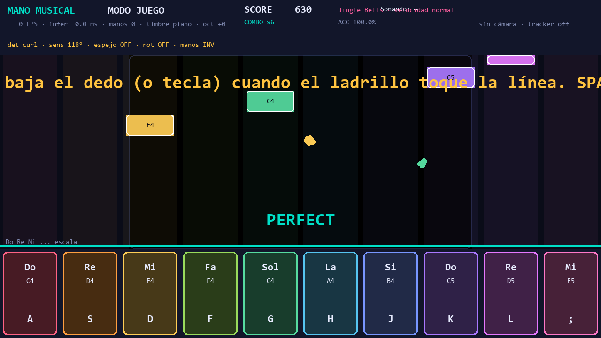
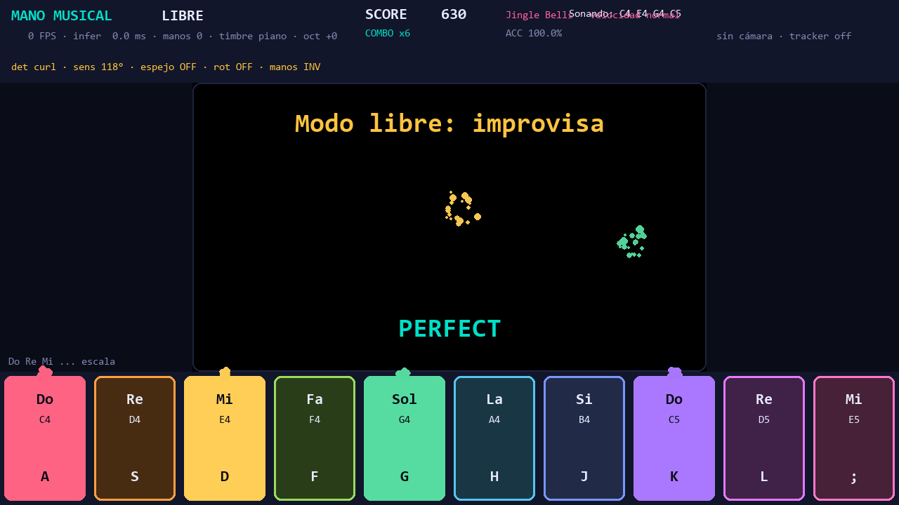
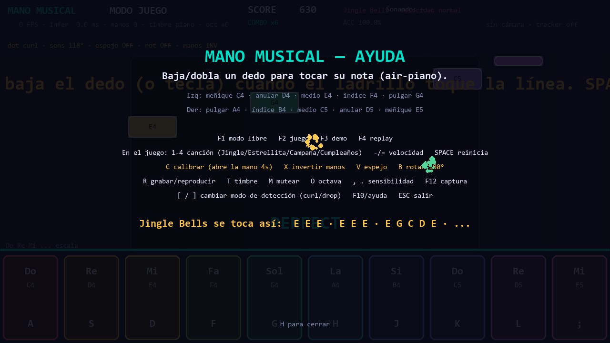

# 🖐️🎹 Mano Musical

**Air-piano con visión por computador.** La cámara ve tus dos manos, reconoce cuál dedo bajas y hace sonar su nota. Diez dedos = diez notas, el rango exacto para tocar **Jingle Bells** en Do mayor sin mover las manos.

> Tesis del proyecto: *no es un piano de teclas, es un piano de gestos*. Tú no pulsas una tecla: **doblas o bajas un dedo en el aire** y el sistema sabe que querías esa nota.



```
              MANO IZQUIERDA                         MANO DERECHA
   meñique  anular  medio  índice  pulgar | pulgar  índice  medio  anular  meñique
     C4       D4      E4     F4     G4    |   A4      B4      C5     D5      E5
     Do       Re      Mi     Fa    Sol    |   La      Si      Do'    Re'     Mi'
```

---

## ✨ Características

- **Detección de manos en tiempo real** con MediaPipe `HandLandmarker` (21 puntos por mano, hasta 2 manos).
- **Detección de "dedo bajado"** por ángulo de flexión (PIP) con histéresis, suavizado temporal y *debounce*. Dos modos: `curl` (doblar el dedo) y `drop` (bajar el dedo respecto a una línea base).
- **Motor de audio polifónico** propio (`pygame.mixer`): cada dedo tiene su canal, permite acordes y notas solapadas.
- **Síntesis aditiva** con armónicos, vibrato y envolvente ADSR. Cuatro timbres: `piano`, `organ`, `chiptune`, `synth`.
- **Arquitectura multi-hilo**: captura, inferencia y render separados (el render nunca se bloquea por la IA).
- **Modo juego tipo piano tiles**: ladrillos que caen por el carril de su tecla, con largo según la duración de la nota. Ventanas *Perfect/Good/OK*, combo, precisión, pantallazo de puntajes al terminar la canción.
- **4 canciones** (`1`-`4`) y **4 velocidades** (`-`/`=`): Jingle Bells, Estrellita, Campana sobre Campana y Cumpleaños Feliz; la velocidad multiplica el BPM.
- **Modo demo** que toca la canción solo, y **grabadora/replay** de tu performance.
- **Partículas, esqueleto de mano, teclado de 10 teclas y HUD** en vivo.
- **Captura de pantalla con `F12`** (se guarda en `docs/img/`).
- **Modo sin cámara / accesibilidad**: toca con el teclado (`A S D F G H J K L ;`).

---

## 🚀 Instalación rápida (Windows / PowerShell)

```powershell
# 1. Clona el repo
git clone https://github.com/TU_USUARIO/mano-musical.git
cd mano-musical

# 2. Crea entorno virtual (recomendado)
python -m venv .venv
.\.venv\Scripts\Activate.ps1

# 3. Instala dependencias y descarga el modelo de MediaPipe
python -m pip install -r requirements.txt
python scripts\download_models.py
```

> En algunos equipos `pip.exe` está bloqueado por políticas de Windows (Application Control).
> Usa siempre `python -m pip ...` en lugar de `pip ...`.

### Linux / macOS

```bash
python3 -m venv .venv && source .venv/bin/activate
python -m pip install -r requirements.txt
python scripts/download_models.py
```

---

## 🎮 Uso

```powershell
# Modo libre (air-piano): improvisa bajando dedos
python -m mano_musical

# Modo juego: las notas caen por el carril de su tecla; tócalas al llegar a la línea
python -m mano_musical --mode game

# Demo automática (para ver cómo suena) y sin cámara
python -m mano_musical --mode demo
python -m mano_musical --no-camera --mode free

# Elegir cámara, timbre y modo de detección
python -m mano_musical --camera 1 --timbre chiptune --detection drop
```

Instalado como script de consola (`pip install -e .`):

```powershell
mano-musical --mode game
```

### Atajos de teclado

| Tecla | Acción |
|-------|--------|
| `F1` | Modo libre |
| `F2` | Modo juego |
| `F3` | Modo demo (autoplay) |
| `F4` | Replay de la última grabación |
| `1`–`4` | Elegir canción (en el modo juego/demo) |
| `-` / `=` | Velocidad: lenta / normal / rápida / experta |
| `SPACE` | Reiniciar la partida (modo juego) |
| `R` | Grabar / detener y guardar |
| `T` | Cambiar timbre |
| `M` | Silenciar / activar audio |
| `O` | Transponer una octava |
| `C` | Calibrar (abre bien la mano ~4 s) |
| `X` | Invertir izquierda/derecha en vivo |
| `V` | Activar/desactivar espejo |
| `B` | Rotar la imagen 180° |
| `,` / `.` | Bajar / subir la sensibilidad del detector |
| `[` / `]` | Cambiar modo de detección (`curl` / `drop`) |
| `F10` o `/` | Ayuda en pantalla |
| `F12` | Guardar captura de pantalla en `docs/img/` |
| `ESC` | Salir |

> **Orientación:** si tu mano derecha toca las notas graves (inicio), pulsa `X`.
> Si toda la imagen se ve espejada o al revés, prueba `V` y/o `B`. Cuando
> encuentres la combinación correcta, fíjala al arrancar con `--swap-hands`,
> `--no-mirror` y/o `--rotate180`.

### Opciones de línea de comandos

| Flag | Descripción | Default |
|------|-------------|---------|
| `--camera N` | Índice de cámara | `0` |
| `--mode free\|game\|demo\|replay` | Modo inicial | `free` |
| `--timbre piano\|organ\|chiptune\|synth` | Timbre | `piano` |
| `--detection curl\|drop` | Cómo se detecta el "dedo bajado" | `curl` |
| `--no-camera` | Modo teclado, sin cámara | off |
| `--no-mirror` | No espejar la imagen | off |
| `--rotate180` | Rotar la imagen 180° | off |
| `--swap-hands` | Invertir izquierda/derecha | **on** |
| `--no-swap-hands` | Desactivar la inversión de manos | off |
| `--mute` | Arrancar en silencio | off |
| `--width` / `--height` | Tamaño de ventana | 1280×720 |
| `--debug` | Log verboso | off |

---

## 🎵 Cómo tocar Jingle Bells (por notas)

Guía completa en **[`docs/COMO_TOCAR.md`](docs/COMO_TOCAR.md)**. Resumen:

```
Jin-gle bells, jin-gle bells, jin-gle all the way
   E   E   E     E   E   E      E   G   C   D   E

Oh what fun it is to ride in a one-horse o-pen sleigh
   F  F  F  F   F   E  E     E  E  D  D  E  D  G
```

En **notas = dedos**: `Mi` es el dedo medio izquierdo, `Sol` el pulgar izquierdo, `Do'` el medio derecho, etc. La tabla completa dedo↔nota está en [`docs/NOTAS_Y_MAPEO.md`](docs/NOTAS_Y_MAPEO.md).

### Canciones del modo juego

| Tecla | Canción | Tempo base | Dificultad |
|-------|---------|-----------|------------|
| `1` | Jingle Bells | 120 BPM | media (saltos C→E) |
| `2` | Estrellita | 78 BPM | fácil, lenta, rango C4–A4 |
| `3` | Campana sobre Campana | 84 BPM | muy fácil (solo C, D, E, G) |
| `4` | Cumpleaños Feliz | 92 BPM | corcheas + notas largas |

`-`/`=` multiplican el tempo: *lenta* (×0.7) → *normal* → *rápida* (×1.35) → *experta* (×1.7).

---

## 📸 Capturas

| Modo libre (air-piano) | Ayuda en pantalla (F10) |
|------------------------|--------------------------|
|  |  |

> Las capturas están generadas sin cámara (fondo negro). Conéctala y pulsa `F12` para las tuyas: se guardan en `docs/img/`.

---

## 🧠 Cómo funciona (pipeline)

```
 Cámara ──► CameraThread ──► SharedState ──► InferenceThread ──► eventos de nota
 (OpenCV)    (hilo I/O)      (frame + id)     (MediaPipe + gesto)        │
                                                                         ▼
                                              AudioEngine (pygame.mixer) + Renderer (pygame)
```

1. **Captura** (`capture.CameraThread`): lee frames, los espeja y publica solo el último (sin colas que crezcan).
2. **Inferencia** (`capture.InferenceThread` + `hand_tracker`): corre `HandLandmarker` en modo VIDEO y obtiene 21 landmarks por mano.
3. **Gesto** (`gesture.FingerPressDetector`): calcula el ángulo de cada dedo, aplica histéresis y emite `Nota ON/OFF` con velocidad.
4. **Audio** (`audio_engine.AudioEngine`): cada voz toca una muestra sintetizada en su propio canal.
5. **Render** (`render.Renderer`): cámara + esqueleto + teclas + partículas + HUD en el hilo principal.
6. **Juego** (`game.RhythmGame`): compara lo tocado con la partitura y puntúa; las notas caen por el carril de su tecla.

Detalle en **[`docs/ARQUITECTURA.md`](docs/ARQUITECTURA.md)**.

---

## 🎨 Puntos de creatividad implementados

- **Air-piano sin contacto**: el gesto es bajar el dedo, no tocar una tecla física.
- **10 dedos = 10 notas** afinadas cromáticamente sobre Do mayor (C4–E5).
- **Dinámica por velocidad**: un dedo que baja rápido suena más fuerte.
- **Acordes**: varios dedos a la vez suenan juntos (polifonía real por canal).
- **Timbre intercambiable en vivo** y transposición de octava por gesto/tecla.
- **Modo juego** con feedback de tiempo real y combo.
- **Partículas** que estallan en la yema que toca, con el color de la nota.
- **Grabación/replay** de performances a JSON.
- **Fallback de teclado**: funciona incluso sin cámara ni MediaPipe.

Más detalles y roadmap de ideas en **[`docs/CREATIVIDAD.md`](docs/CREATIVIDAD.md)**.

---

## 🗂️ Estructura del repositorio

```
mano-musical/
├── README.md
├── CHANGELOG.md
├── CONTRIBUTING.md
├── LICENSE
├── pyproject.toml
├── requirements.txt
├── assets/
│   ├── models/            # hand_landmarker.task (se descarga solo al primer uso)
│   └── songs/             # partituras JSON (jingle_bells.json; el resto va embebida en music.py)
├── docs/
│   ├── img/                # capturas de pantalla (F12 las genera)
│   ├── ARQUITECTURA.md
│   ├── BITACORA.md         # diario de desarrollo
│   ├── COMO_TOCAR.md
│   ├── CREATIVIDAD.md
│   └── NOTAS_Y_MAPEO.md
├── scripts/
│   ├── download_models.py
│   ├── run.ps1
│   └── setup.ps1
├── src/mano_musical/
│   ├── __init__.py
│   ├── __main__.py
│   ├── app.py              # orquestador principal
│   ├── audio_engine.py     # sintetizador polifónico
│   ├── capture.py          # hilos de cámara e inferencia
│   ├── config.py           # constantes y mapas
│   ├── game.py             # modo juego + autoplay
│   ├── gesture.py          # detección de "dedo bajado"
│   ├── hand_tracker.py     # wrapper MediaPipe
│   ├── music.py            # teoría, síntesis y canciones
│   ├── recorder.py         # grabación/replay
│   ├── render.py           # pygame: HUD, teclas, partículas
│   ├── state.py            # estado compartido entre hilos
│   └── utils.py
└── tests/
    ├── test_game.py
    ├── test_gesture.py
    ├── test_music.py
    └── test_recorder.py
```

---

## 🧪 Tests

```powershell
python -m pip install pytest
python -m pytest -q
```

39 tests cubren teoría/síntesis musical, serialización de canciones, detección de gestos con landmarks sintéticos, lógica de puntaje (ventanas, combo, fin de partida), velocidades y grabación/replay. El motor de audio se puede testear sin dispositivo (`AudioEngine(enabled=False)`).

---

## 📓 Bitácora

El diario de decisiones técnicas (qué se probó, qué falló, por qué) está en **[`docs/BITACORA.md`](docs/BITACORA.md)**.

---

## 🛣️ Roadmap

- [ ] Calibración guiada interactiva (10 s) al arrancar.
- [ ] Detección de mano con profundidad (`z`) para el modo `drop`.
- [ ] Backing track con bajo y batería sintetizados.
- [ ] Editor de canciones y carga de MIDI.
- [ ] Exportar la performance a `.wav`/`.mid`.
- [ ] Soporte de dos jugadores y puntaje compartido.

---

## 📄 Licencia

MIT © 2026 Mano Musical contributors. Ver [`LICENSE`](LICENSE).
